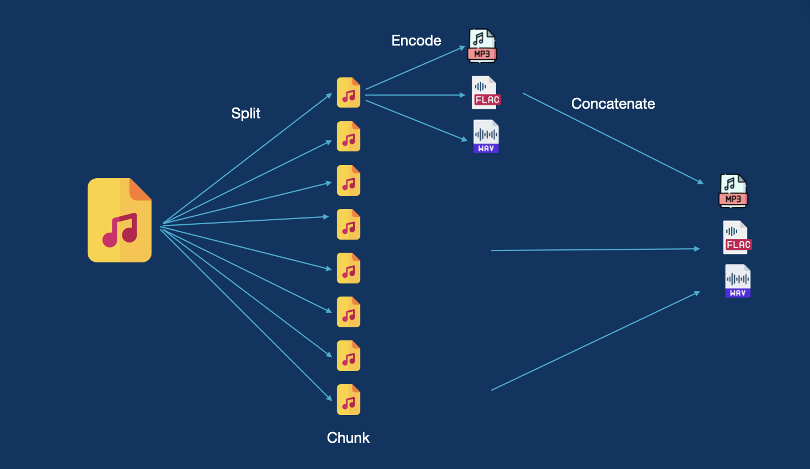
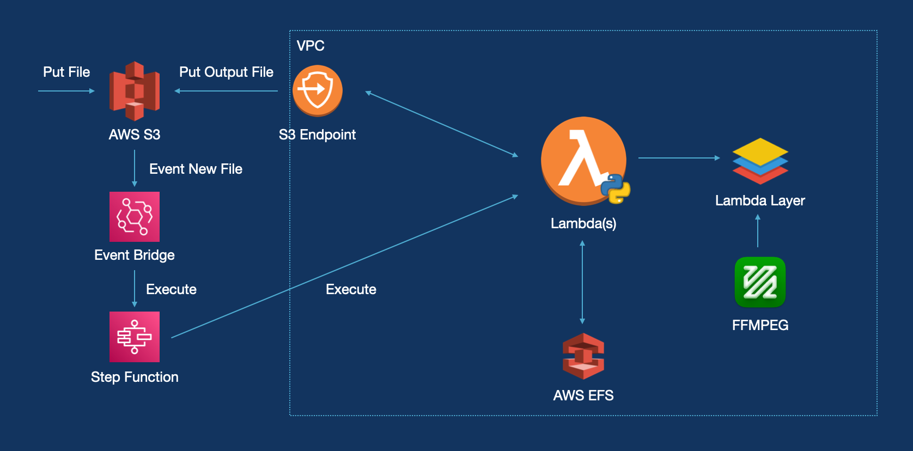

# lambda-transcode

This project is a POC for a lamda transcode solution

The idea is to reduce the cost of a transcode and improve the speed of the transcocde too

Idea behind that

The architecture for this kind of project:

Idea to improve this POC
- Dynamic Parameters
- Video transcode
- Verify the audio file in output